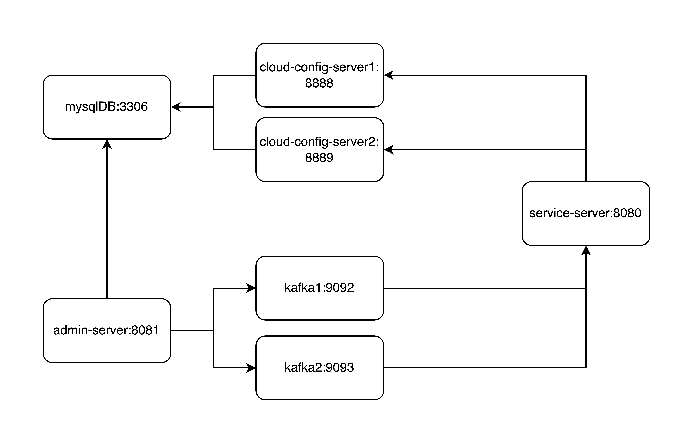

# configexam

이 프로젝트는 **Spring Cloud Config**를 커스텀하여 고가용성(HA)  설정 변경을 실시간으로 적용하는 구조를 포함하고 있습니다.

자동화된 스크립트로 다양한 장애 시나리오를 검증할 수 있습니다.

## 📂 주요 디렉터리

- `cloud-config-server/`: Config Server
- `service-server/`: 일반 서비스 서버 (config-client 해당)
- `admin-server/`: 어드민 서버
- `docker-compose.yml`: 테스트를 위해 전체 인프라 서비스 정의
- `script-*.sh`: 테스트 자동화 스크립트

## 테스트 컴포넌트 구조



## 🚀 실행 방법
jq, docker, docker-compose가 설치되어 있어야 합니다.
jq는 JSON 데이터를 포맷팅 위한 CLI 도구입니다.

jq 설치
```bash
brew install jq
```

실행 전 모든 스크립트에 실행 권한을 부여하세요:
```bash
chmod +x script-*.sh
```

그 다음 아래 스크립트를 실행하여 환경을 구성합니다:

```bash
./script-docker_compose-build_and_up.sh
```


## 🧪 테스트 시나리오

아래의 스크립트들은 실제 장애 상황을 시뮬레이션하거나 설정 기능을 점검합니다:

- `scenario_1-feature_on_off.sh`: 기능 플래그 ON/OFF 테스트
- `scenario_2-targeted_bean_refresh.sh`: 특정 빈만 설정 갱신
- `scenario_3-kafka_stream_eager_lazy_check.sh`: 빈의 eager/lazy 동작 테스트
- `scenario_4-cloud_config_server1_down.sh`: Config Server 1 다운 시 시나리오
- `scenario_5-kafka1_down.sh`: Kafka 클러스터 장애 테스트 (standalone kafka broker 1개를 클러스터라 가정)

## 참고
- service-server 인스턴스 별로 새로운 consumer group id가 생성되기 때문에 새로운 인스턴스 배포시, 삭제된 인스턴스에 대해 consumer-group-id를 제거하는 동작 필요. (spring-cloud-bus 동일 이슈) 
